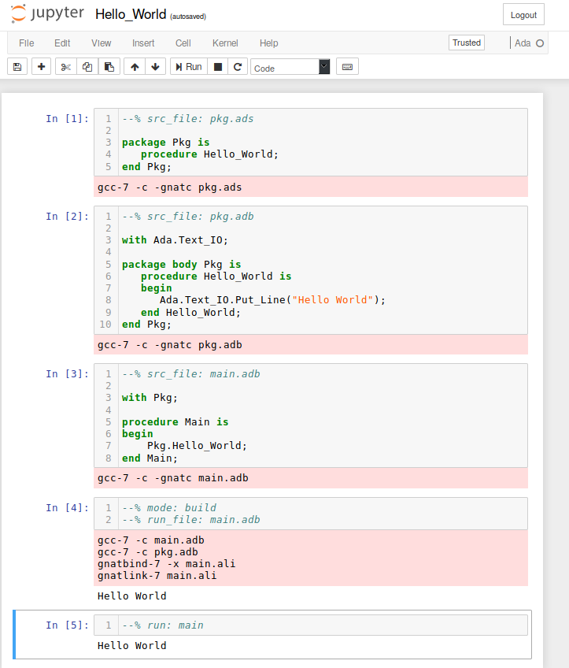

Minimal Ada kernel for Jupyter
==============================

Introduction
---------------

This Package contains a Jupyter kernel for the Ada language. The
[Jupyter C kernel](https://github.com/brendan-rius/jupyter-c-kernel) was used
as a starting point for this implementation.


License & Copyright
----------------------

This Package is available "as is" under MIT License. The copyright of the
Jupyter C kernel --- used as a starting point for this implementation --- is
held by Brendan Rius. Unless stated otherwise, the copyright of the Ada kernel
for Jupyter is held by Gustavo A. Hoffmann.


Supported Platforms
----------------------

This Package has been tested on the following compilers / platforms:

- Linux / Python 3.6
- Windows / Python 3.6


Features
-----------

- Support for Ada language in Jupyter notebooks
- Support for running compiler and linker (GNAT) in the background
- Support for specifying multiple source-code files in the same notebook


Known Issues and Limitations
-------------------------------

### Platforms

- This Package has not been tested on the Mac platform.

### Features

- Syntax highlighting requires manual installation.

### Documentation

- Extensive documentation and tutorials are missing.


Installation
---------------

Details about the installation can be found
[on this document](Installation.md).


Usage
--------

Please refer to the Jupyter documentation for details on how to create and use
notebooks.

In order to use the Ada kernel, the first step is to select "Ada" from the list
of kernels supported by the Jupyter installation. As soon as the kernel has
started, you may enter Ada code by specifying the filename in the comments:

```ada
--% filename: main.adb

with Ada.Text_IO;

procedure Main is
begin
    Ada.Text_IO.Put_Line("Hello World");
end Main;
```

The filename is required for creating the source-code file for the GNAT
compiler. Click on 'Run' on the toolbar to compile the code.

In order to build and run the executable based on the procedure _Main_, enter
the following line and click on 'Run' on the toolbar:

```ada
--% run: Main
```

### Example of notebook

This Package contains an [example of a notebook](examples/Hello_World.ipynb):


